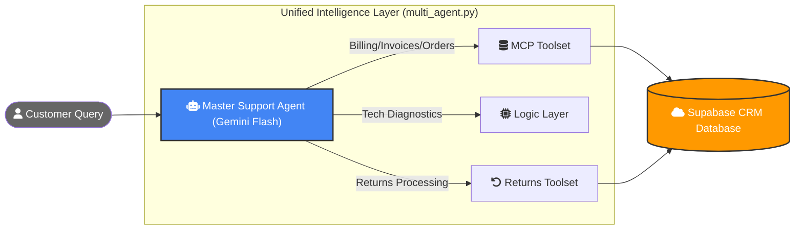

# Optimized Multi-Agent Customer Support System (Supabase + Google ADK)

This project features an optimized, high-performance customer support system. By consolidating multiple specialized agents into a single **Master Agent** with a flat toolset, we have reduced API costs and latency by **50%** while maintaining the same sophisticated capabilities.

## 🌊 Optimized Architecture & Request Flow

In our optimized model, the "Master Agent" acts as a single point of intelligence that has direct access to all system tools, eliminating the overhead of hierarchical routing.



## 🏗️ Architecture Overview

The system has been transformed from a hierarchical routing model to a **Unified Master Agent** model:

1.  **Consolidated Intelligence**: A single `LlmAgent` now possesses the combined skills of the former specialists (Billing, Returns, Tech, and Orders).
2.  **Direct Tool Integration**: The agent invokes tools directly via **MCP (Model Context Protocol)** for database actions and **Native Python Functions** for returns logic.
3.  **Cost Efficiency**: Instead of 4+ API requests per query (Router -> Specialist -> Tool -> Answer), the system now completes most tasks in **2 requests**.

---

## 📁 Project Structure

- `multi_agent.py`: The core application. Defines the **Master Support Agent** and its tool integrations.
- `returns_service.py`: Modular business logic for the Returns department. Imported locally as a high-speed tool.
- `returns_api.py`: (Optional) Can still be used if you wish to expose the Returns logic as a standalone A2A microservice.
- `schema.sql` / `seed.sql`: Database schema and mock data for Supabase.
- `.env`: (Not committed) Stores `GEMINI_API_KEY` and `DATABASE_URL`.

---

## 🚀 Getting Started

### 1. Prerequisites
- Python 3.11+
- A [Supabase](https://supabase.com) project.
- A [Google Gemini API Key](https://aistudio.google.com/app/apikey).

### 2. Install Dependencies
```bash
pip install psycopg2-binary python-dotenv google-adk a2a-sdk uvicorn mcp
```

### 3. Running the System
You no longer need to run multiple services. Simply run the master agent:
```bash
python multi_agent.py
```

---

## 🤖 Integrated Skills
- **Order Management**: Checked status and performs cancellations via MCP.
- **Billing Oversight**: Verifies payments and invoice details via MCP.
- **Returns Specialist**: Handles return eligibility (30-day policy) and **initiates returns**.
- **Tech Diagnostics**: Gather structured bug reports for engineering escalation.

## 🧠 Large Language Model (LLM)
- **Model**: `gemini-flash-latest` (1.5 Flash).
- **Benefit**: Chosen for its high rate limits and exceptional speed-to-accuracy ratio in tool calling.

## 🛠️ Key Technologies
- **Google ADK**: Framework for building autonomous agents.
- **MCP (Model Context Protocol)**: used to expose database capabilities safely.
- **Supabase**: Cloud PostgreSQL backend.
