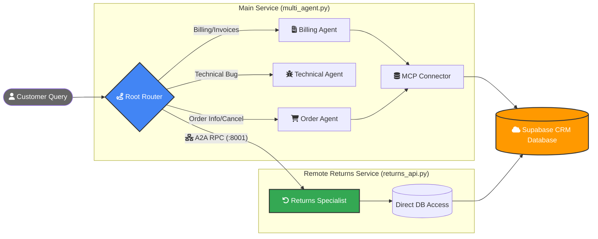

# Multi-Agent Customer Support System (Supabase + Google ADK)

This project demonstrates a distributed, multi-agent customer support system integrated with a Supabase PostgreSQL database. It utilizes Google's **Agent Development Kit (ADK)** and the **Agent-to-Agent (A2A)** protocol to create a modular, scalable architecture.

## � Architecture & Request Flow

The following flowchart illustrates how a support request moves through the system:



## 🏗️ Architecture Overview

The system uses a **Distributed A2A (Agent-to-Agent)** model where specialized agents run in separate processes and communicate over the network.

1.  **Main Router (`multi_agent.py`)**: The entry point of the system.
    *   **RootRouterAgent**: Uses an LLM to analyze user intent and route to specialists.
    *   **Billing & Order Specialists**: Connected to the database via **MCP (Model Context Protocol)** for real-time order and invoice verification.
    *   **Local Specialists**: Technical Escalation and General Support agents run locally to handle non-database support tasks.
2.  **Returns Specialist Service**:
    *   **Logic Layer (`returns_service.py`)**: Defines the `ReturnsSpecialistAgent` and its specific tools (`check_return_eligibility`, `initiate_return`).
    *   **API Layer (`returns_api.py`)**: A standalone A2A web service running on `http://localhost:8001`. It receives RPC calls from the Router and processes returns independently.

---

## 📁 Project Structure

- `multi_agent.py`: Main router and local agent definitions. Uses `RemoteA2aAgent` to talk to the Returns service.
- `returns_service.py`: Logic and database tools for the Returns Specialist.
- `returns_api.py`: The A2A server that hosts the Returns Specialist as a standalone microservice on port 8001.
- `schema.sql` / `seed.sql`: Database schema and mock data for Supabase.
- `.env`: (Not committed) Stores sensitive credentials like `GEMINI_API_KEY` and `DATABASE_URL`.

---

## 🚀 Getting Started

### 1. Prerequisites
- Python 3.11+
- A [Supabase](https://supabase.com) project with a PostgreSQL database.
- A [Google Gemini API Key](https://aistudio.google.com/app/apikey).

### 2. Install Dependencies
```bash
pip install psycopg2-binary python-dotenv google-adk a2a-sdk uvicorn mcp
```

### 3. Configure Environment
Create a `.env` file referencing `.env.example`:
```env
DATABASE_URL=postgresql://postgres:[PASSWORD]@[HOST]:5432/postgres
GEMINI_API_KEY=your_api_key_here

# MCP Connection Details
POSTGRES_HOST=[HOST]
POSTGRES_PORT=5432
POSTGRES_USER=postgres
POSTGRES_PASSWORD=[PASSWORD]
POSTGRES_DB=postgres
ALLOW_WRITE_OPERATIONS=true
```

### 4. Running the System
Run these in two separate terminal windows:

**Terminal 1: Start the Remote Returns Service**
```bash
python returns_api.py
```

**Terminal 2: Start the Main Support Router**
```bash
python multi_agent.py
```

---

## 🤖 The Agents
- **Root Router**: Analyzes requests and delegates to the right specialist.
- **Order Status Agent**: Manages orders (queries and cancellations) via MCP.
- **Billing Agent**: Verifies payments and invoice amounts via MCP.
- **Returns Specialist (Remote)**: Handles return eligibility and **initiates returns** via A2A.
- **Technical Agent**: Handles bugs and system errors (Locally).
- **General Support**: Handles greetings and FAQs (Locally).

## 🧠 Large Language Model (LLM)

- **Default Model**: `gemini-2.5-flash` (or fallback to `gemini-flash-latest` during peak quota).
- **Configuration**: All agents are tuned for precise tool invocation and intent classification.

## 🛠️ Key Technologies
- **Google ADK**: Framework for building autonomous agents.
- **A2A (Agent-to-Agent)**: RPC protocol for cross-process agent communication.
- **MCP (Model Context Protocol)**: used to expose database capabilities safely to LLMs.
- **Supabase**: Cloud PostgreSQL backend.
